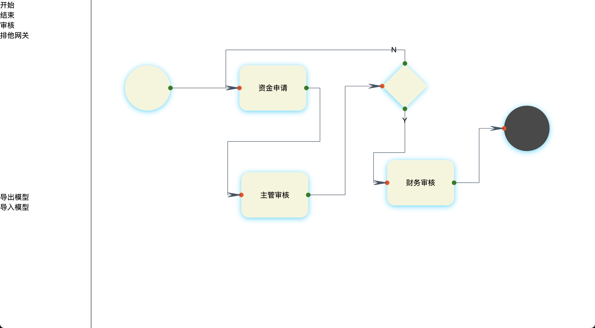

# 用于快速实现流程的超简单工作流
主要用于快速搭建客户需求，快速做出可展示的样品  

该项目由两部分组成：
1. 流程定义生成工具 `flow-designer`
2. 流程引擎 `FlowSession`

## 流程设计工具 flow-designer
进入 flow-designer 目录，执行
```
npm install
npm run serve
```
打开 http://localhost:8080/  
绘制一个流程图，然后导出

以下是我们获取的流程定义：

```json
[
    {
        "id": 2156800624188949000,
        "name": "start",
        "type": "START",
        "nextNodeType": "AUDIT",
        "nextNode": 14737642928429818000,
        "offsetLeft": "74",
        "offsetTop": "144"
    },
    {
        "id": 14737642928429818000,
        "name": "资金申请",
        "type": "AUDIT",
        "nextNodeType": "AUDIT",
        "offsetLeft": "326",
        "offsetTop": "144",
        "auditor": [],
        "nextNode": 69960664860100810000
    },
    {
        "id": 69960664860100810000,
        "name": "主管审核",
        "type": "AUDIT",
        "nextNodeType": "EXCLUDE_GATEWAY",
        "offsetLeft": "330",
        "offsetTop": "380",
        "auditor": [],
        "allow": 4127634792803358000,
        "reject": 14737642928429818000,
        "excludeGateway": {
            "offsetLeft": "640",
            "offsetTop": "140",
            "id": 44484742982885440,
            "name": "",
            "updot": "reject",
            "downdot": "allow"
        }
    },
    {
        "id": 3276004840815968000,
        "name": "end",
        "type": "END",
        "offsetLeft": "908",
        "offsetTop": "233"
    },
    {
        "id": 4127634792803358000,
        "name": "财务审核",
        "type": "AUDIT",
        "nextNodeType": "END",
        "offsetLeft": "651",
        "offsetTop": "353",
        "auditor": [],
        "nextNode": 3276004840815968000
    }
]
```
将该文件保存好，接下来在 java 程序中使用

## 流程引擎 FlowSession

```java
public class Main {

    static String FLOW_DEFINITION = ""; // 将之前的流程定义粘贴到这里

    // 模拟用户登录
    public static class FakeThreadSession {
        public static Collection<String> authority;
        public static String user;

        public static Collection<String> getAuthority() {
            return authority;
        }

        public static String getUser() {
            return user;
        }
    }

    public static void main(String[] args) {

        // 创建流程引擎
        FlowSession flowSession = new FlowBuilder()
                .setDatabase(new H2DatabaseInfo()) // 指定数据类型
                .setGetLoginUser(new LoginUser() {
                    @Override
                    public Collection<String> getAuthority() {
                        return FakeThreadSession.getAuthority();
                    }

                    @Override
                    public String user() {
                        return FakeThreadSession.getUser();
                    }
                })
                .build();

        // 创建流程
        Long flowId = flowSession.createFlow("小明的项目资金申请", "项目资金申请", FLOW_DEFINITION);


        // 设置结点的审批人，这个可以在前端绘制流程引擎时指定，也可在这里重新指定
        flowSession.changeAuditor(flowId, "资金申请", Arrays.asList("小明"));
        flowSession.changeAuditor(flowId, "主管审核", Arrays.asList("主管"));
        flowSession.changeAuditor(flowId, "财务审核", Arrays.asList("财务"));

        // 启动
        flowSession.getFlow(flowId).start();

        // 查询流程进度
        printCurrentNode(flowSession, flowId);

        // 特殊权限指：用在任务列表查询处。
        // 用来实现控制获得处在非自己所管理结点的流程，以实现全局查看，全局修改，任意结点审批等。
        // -1 只是个编码，可以有任意多个特殊权限，看需求，specialCode 规定只能是负数
        // 这里将 -1 绑定到 "主管审核" 上，用有 主管审核 权限的人 同时拥有 -1 code
        flowSession.setSpecialAuditor(flowId, Arrays.asList("主管审核"), -1L);

        flowSession.openSession(() -> { // 确保局部数据安全
            FakeThreadSession.user = "小明";
            FakeThreadSession.authority = Arrays.asList("资金申请");

            Map<String, String> form = new HashMap<>(2);
            form.put("reason", "用于项目"); // 理由
            form.put("amount", "1000"); // 金额多少
            flowSession.getFlow(flowId)
                    .setData(form); // 小明提交表单

            flowSession.getFlow(flowId)
                    .getCurrentTasks()
                    .complete(); // 小明提交申请
        });

        // 查询流程进度
        printCurrentNode(flowSession, flowId);


        flowSession.openSession(() -> { // 确保局部数据安全
            FakeThreadSession.user = "主管";
            FakeThreadSession.authority = Arrays.asList("主管审核");

            Map<String, String> form = new HashMap<>(1);
            form.put("master_suggest", "理由不明确"); // 主管填写表单
            flowSession.getFlow(flowId)
                    .setData(form);

            flowSession.getFlow(flowId)
                    .getCurrentTasks()
                    .reject(); // 拒绝
        });

        // 查询流程进度
        printCurrentNode(flowSession, flowId);


        flowSession.openSession(() -> {
            FakeThreadSession.user = "主管";
            FakeThreadSession.authority = Arrays.asList("主管审核");

            // 当前任务结点应是小明重新填写表单
            // 现在登录人是主管，按理说主管不能获取当前结点的流程
            // 假设现在他想帮小明填写表单，可通过 specialCode 来获取进程
            PageInfo<Long> p = flowSession.queryCommissions("项目资金申请", new PageInfo<>(0, 10), -1L);

            Map<String, String> form = new HashMap<>(1);
            form.put("reason", "我是主管，我代小明补充细节"); // 通过specialCode主管代小明填写表单
            flowSession.getFlow(p.getRecordsList().get(0)) // 这里演示直接取0了，如果有多个流程，主要区分
                    .setData(form);

            flowSession.getFlow(p.getRecordsList().get(0))
                    .getCurrentTasks()
                    .complete(); // 主管替小明提交

            // 查询流程进度
            printCurrentNode(flowSession, flowId);

            flowSession.getFlow(p.getRecordsList().get(0))
                    .getCurrentTasks()
                    .complete(); // 主管给自己审批同意
        });

        // 查询流程进度
        printCurrentNode(flowSession, flowId);

        flowSession.openSession(() -> { // 确保局部数据安全
            FakeThreadSession.user = "财务";
            FakeThreadSession.authority = Arrays.asList("财务审核");

            Map<String, String> form = new HashMap<>(1);
            form.put("financial_department", "无误，批了"); // 填写表单
            flowSession.getFlow(flowId)
                    .setData(form);

            flowSession.getFlow(flowId)
                    .getCurrentTasks()
                    .complete(); // 同意
        });

        // 查询流程进度
        printCurrentNode(flowSession, flowId);

        // 打印审批历史
        System.out.println("审批历史：" + JSONArray.toJSONString(flowSession.getFlow(flowId).getHistory(), true));
    }

    public static void printCurrentNode(FlowSession flowSession, Long flowId){
        FlowInfo info = flowSession.getFlow(flowId).getInfo();
        System.out.println("当前结点：" + info.getCurrentNode());
        System.out.println("表单：" + JSONArray.toJSONString(info.getFlowData()));
    }
}
```
运行程序，让我们看看运行过程，以下是控制台输出内容：  
```
当前结点：资金申请
表单：{}
当前结点：主管审核
表单：{"reason":"用于项目","amount":"1000"}
当前结点：资金申请
表单：{"reason":"用于项目","amount":"1000","master_suggest":"理由不明确"}
当前结点：主管审核
表单：{"reason":"我是主管，我代小明补充细节","amount":"1000","master_suggest":"理由不明确"}
当前结点：财务审核
表单：{"reason":"我是主管，我代小明补充细节","amount":"1000","master_suggest":"理由不明确"}
当前结点：end
表单：{"reason":"我是主管，我代小明补充细节","amount":"1000","master_suggest":"理由不明确","financial_department":"无误，批了"}
审批历史：[
	{
		"creationTime":1669877697000,
		"currentNodeName":"资金申请",
		"flowId":583406313,
		"historyForm":{},
		"operation":"开始流程",
		"preNodeName":"start"
	},
	{
		"creationTime":1669877697000,
		"currentNodeName":"主管审核",
		"flowId":583406313,
		"historyForm":{
			"reason":"用于项目",
			"amount":"1000"
		},
		"operation":"审批完成",
		"operator":"小明",
		"preNodeName":"资金申请"
	},
	{
		"creationTime":1669877697000,
		"currentNodeName":"资金申请",
		"flowId":583406313,
		"historyForm":{
			"reason":"用于项目",
			"amount":"1000",
			"master_suggest":"理由不明确"
		},
		"operation":"拒绝",
		"operator":"主管",
		"preNodeName":"主管审核"
	},
	{
		"creationTime":1669877697000,
		"currentNodeName":"主管审核",
		"flowId":583406313,
		"historyForm":{
			"reason":"我是主管，我代小明补充细节",
			"amount":"1000",
			"master_suggest":"理由不明确"
		},
		"operation":"审批完成",
		"operator":"主管",
		"preNodeName":"资金申请"
	},
	{
		"creationTime":1669877697000,
		"currentNodeName":"财务审核",
		"flowId":583406313,
		"historyForm":{
			"reason":"我是主管，我代小明补充细节",
			"amount":"1000",
			"master_suggest":"理由不明确"
		},
		"operation":"同意",
		"operator":"主管",
		"preNodeName":"主管审核"
	},
	{
		"creationTime":1669877697000,
		"currentNodeName":"end",
		"flowId":583406313,
		"historyForm":{
			"reason":"我是主管，我代小明补充细节",
			"amount":"1000",
			"master_suggest":"理由不明确",
			"financial_department":"无误，批了"
		},
		"operation":"流程结束",
		"operator":"财务",
		"preNodeName":"财务审核"
	}
]
Disconnected from the target VM, address: '127.0.0.1:56754', transport: 'socket'

Process finished with exit code 0

```

# FlowSession的其他重要函数
- `add***Lisener` 添加监听器，如流程启动、结束，到某个节点等
- `query***` 查询流程列表，可查询我参与的、已完成的、待处理的；配合specialCode还可实现一些特殊功能
    - `FlowDataQuery` 该对象用于实现条件查询，配合表单内容查询

# 特别注意
该项目只是为了快速进行搭建出演示作品而用，切忌不要用于实际生产环境，实际生产未做测试